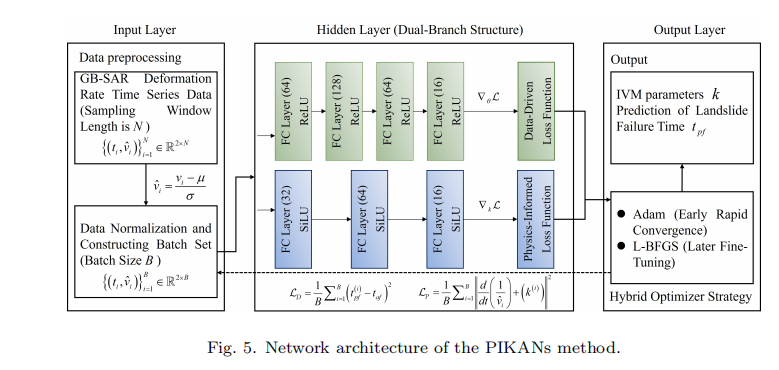
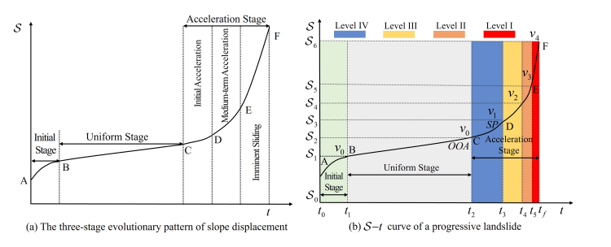

## PIKANs: Physics-Informed Kolmogorov-Arnold Networks for Landslide Time-to-Failure Prediction

### Abstract

> *lope deformation is characterized by pronounced time variability and complexity. Although ground-based synthetic aperture radar (GB-SAR) provides
high-frequency, broad monitoring, its strong oscillations and large fluctuations
can impair predictive performance. To address this, the raw displacement sequence is first smoothed via misaligned subtraction to suppress high-frequency
noise and highlight key deformation trends. A dynamic confidence boundary
is then established on the inverse-velocity curve to robustly identify the acceleration start point. Subsequently, physics-informed Kolmogorov-Arnold networks (PIKANs) are formulated to embed the displacement-time evolution equation into the basis-function space of the Kolmogorov-Arnold network (KAN),
thereby unifying nonlinear deformation dynamics with the governing physical
laws of landslide motion. During model training, an alternating optimization
scheme combining Adam and the L-BFGS algorithm accelerates convergence
and enhances predictive accuracy. Comparative experiments on field GB-SAR
datasets demonstrate that compared with an improved KAN baseline and a
physics-informed neural network benchmark, PIKANs reduce the relative error
Email addresses: Corresponding author: jswanwo@gmail.com (Jiashan Wan),
1033348860@qq.com (Liangjun Wen), w124302075@stu.ahu.edu.cn (Ziheng Jian),
jhwu3@iflytek.com (Jinhua Wu), sakajy21@gmail.com (Jingyang Li), abzzorro@gmail.com
(Mengqi Lian), wangkai_anhui@foxmail.com (Kai Wang)
Preprint submitted to Computers & Geosciences September 2, 2025
in failure-time prediction by 24.24% and 30.23%, respectively. These results
confirm that integrating physical equation constraints into neural network parameter updates substantially improves the precision and efficiency of real-time
landslide early warning.
Keywords: Failure time of landslides, ground-based synthetic aperture radar,
physics-informed neural network, Kolmogorov-Arnold networks**

## 1.Introduction

  

  

A GB-SAR cumulative-displacement map can contain tens to hun- 60
dreds of thousands of pixels, each associated with its own S − t curve (wherein 61
S denotes displacement). After each scan, displacement data are incremen- 62
tally updated in a matter of minutes to generate a new displacement map (in 63
Fig. 2, t0 denotes the start of monitoring and taf represents the actual time 64
of failure). Automatically identifying potential danger zones in these massive, 65
rapidly evolving datasets and accurately predicting the time of instability in 66
real time remains an urgent challenge. 67
To address this, we propose a GB-SAR-based method for predicting landslide 68
instability time in open-pit mines. We validate its feasibility and accuracy 69
through both numerical simulations and field GB-SAR datasets. The main 70
contributions are: 71
• Leveraging the Kolmogorov-Arnold theorem, we design physics-informed 72
Kolmogorov-Arnold networks (PIKANs) to replace conventional multi- 73
layer perceptron (MLP) architectures, markedly reducing parameter count 74
and data requirements while enhancing real-time predictive performance. 75
• We introduce a mechanism that dynamically constructs confidence bounds 76
on the INV curve to detect the starting point (SP) robustly and impose 77
physical parameter constraints when SP is triggered, thereby eliminat- 78
ing the detection lag inherent in traditional onset of acceleration (OOA) 79
methods under noisy conditions. 80
• We develop a mixed optimization scheme that alternates between the first- 81
order Adam optimizer (for rapid convergence) and the second-order L- 82
BFGS method (for high precision), effectively avoiding local minima and 83
improving both training efficiency and prediction accuracy
  

Loss trend comparison between TFPredictor and other benchmark models at different epoch counts
provides a detailed comparison of loss trends with increasing epochs under different architectures. From the analysis, it is evident that the Mamba model has significant advantages over Transformer-based models. To quantify the performance advantages of the ScaKAN component in the model further, we present the loss trends for MLP and ScaKAN in our model in Fig.ScaKAN outperforms MLP, with the 4-layer KAN structure performing the best. Its loss decreases rapidly to the minimum level after relatively few epochs and remains stable. This indicates that ScaKAN not only provides more accurate prediction results but also maintains consistency under different traffic conditions, which is crucial for real-world traffic prediction scenarios.
We design a model with linear time ${\cal O}\left( n \right)$ complexity, which not only improves prediction accuracy but also effectively shortens inference time, reduces computational costs, and enhances the model's practicality and scalability.

## 2. Related work

The core of early warning of open-pit mine-slope failure lies in acquiring 87
key information by monitoring surface displacements to predict the precise lo- 88
cation, area, and timing of landslides (Wang et al., 2024b). Surface-deformation 89
monitoring techniques are broadly classified into contact (point-based) and non- 90
contact (area-based) methods. Conventional total-station, leveling, and GNSS 91
single-point measurements fall under the contact category, whereas 3D laser 92
scanning and synthetic aperture radar (SAR) constitute typical non-contact, 93
area-based approaches. The measurement modes, accuracies, advantages, and 94
disadvantages of these techniques are summarized in Table I. 95
SAR technology is categorized into three modes: spaceborne, airborne, and 96
ground-based, according to the platform. Spaceborne and airborne SAR are well 97
suited for monitoring large-area but suffer from substantial orbital positioning 98
errors, long revisit intervals, and slow emergency response. In contrast, GB-SAR 99
offers superior flexibility and real-time capability and has been widely applied 100
to surveillance of mining operations (Ding et al., 2024), bridges (Wang et al., 101
2024c), and natural slopes (Herrero et al., 2022)

## 3.Problem denition

  

andslide events typically progress through a three-stage evolution from ini- 194
tial deformation to eventual failure: the initial deformation stage, the constant- 195
rate deformation stage, and the accelerating deformation stage (FUKUZONO, 196
1985). The deformation characteristics in each stage differ markedly, as shown 197
in Fig. 3(a). During the initial deformation stage (segment AB in the figure), the 198
slope undergoes decelerating deformation: Displacement acceleration gradually 199
10
Fig. 3. Three-stage evolution of slope displacement, with the acceleration stage divided into
four warning levels.
decreases, and both the slope of the displacement-time curve and the tangent 200
angle of the displacement decline continually. In the constant-rate deformation 201
stage (segment BC), displacement and time exhibit a strong positive correlation, 202
the curve’s slope approaches a constant value, deformation velocity fluctuates 203
around a stable mean, and acceleration remains near zero. In the accelerating 204
deformation stage (segment CF), the positive correlation between displacement 205
and time weakens, the correlation coefficient decreases, and both deformation 206
velocity and acceleration increase, with the tangent angle of the displacement 207
curve rising progressively; see Fig. 3(b). Research has indicated that the rate 208
and acceleration characteristics immediately before and after the onset of the 209
accelerating deformation stage have a significant impact on the variation of the 210
tangent angle of the displacement-time curve (Qiang et al., 2009; Liu et al., 211
2024b).
## 4. Conclusion
In this paper, we developed PIKANs, a landslide instability-time predic- 536
tion method based on GB-SAR monitoring data, which markedly improves the 537
accuracy and timeliness of early warning. The key contributions are: 538
(1) Accurate detection of the SP. To overcome the detection lag caused 539
by noise in conventional approaches, we introduce a dynamic SP positioning 540
strategy based on normal-distribution confidence intervals, enabling real time 541
capture of the landslide’s acceleration phase. 542
(2) Dynamic parameter calibration and the advantage of high- 543
frequency monitoring. At the Dexing open-pit mine, leveraging minute-level, 544
real-time, high-frequency, high-precision GB-SAR monitoring allows PIKANs 545
parameters to be continuously updated, ensuring predictions remain close to 546
the actual failure time. At the Xinjing open-pit mine, however, SBAS-InSAR 547
is constrained by revisit intervals (typically several days to 2 weeks), making 548
it difficult to capture short-term deformation and causing a general decline in 549
prediction accuracy across all models. Although PIKANs delivers the best per- 550
formance on both datasets, high-frequency monitoring clearly plays a decisive 551
role in precisely predicting landslide failure times. 552
(3) Experimental validation and performance enhancement. Using 553
field-based GB-SAR datasets from an open-pit mine, PIKANs reduces the RE 554
of instability-time prediction by 30.23% compared to a PINN baseline and by 555
24.24% compared to an improved KAN model (TimeKAN), demonstrating a 556
substantial gain in predictive accuracy. Although PIKANs delivers exceptional 557
results during the acceleration stage, predicting failure in the constant rate and 558
deceleration phases remains challenging. Future work will focus on: 559
• Developing generalization strategies for limited-data scenarios across di- 560
verse geological settings. 561
• Extending model adaptability to varied deformation patterns (e.g., constant- 562
rate, deceleration). 563
30
• Optimizing real-time early-warning performance to enhance the method’s 564
practicality and robustness. 565
CRediT authorship contribution

