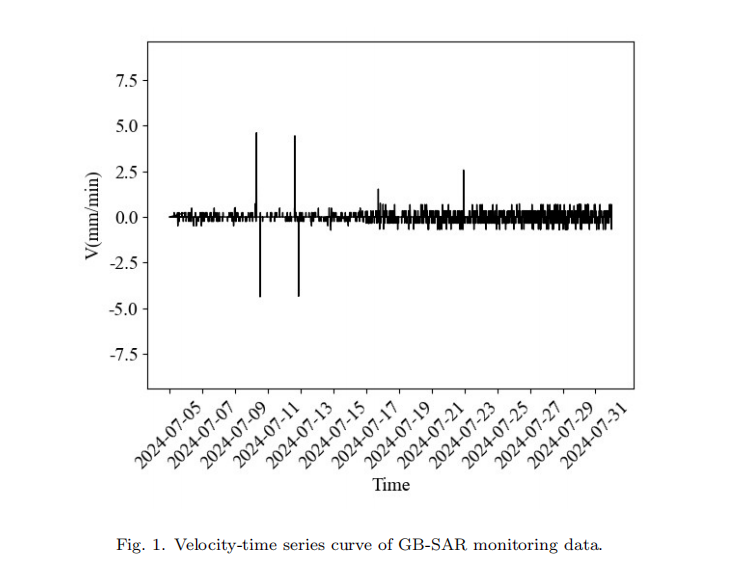
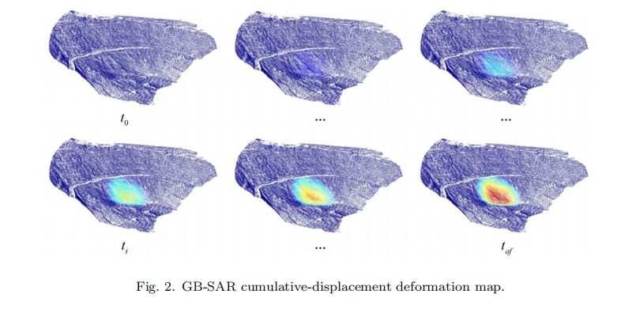

## PIKANs: Physics-Informed Kolmogorov-Arnold Networks for Landslide Time-to-Failure Prediction

lope deformation is characterized by pronounced time variability and complexity. Although ground-based synthetic aperture radar (GB-SAR) provides
high-frequency, broad monitoring, its strong oscillations and large fluctuations
can impair predictive performance. To address this, the raw displacement sequence is first smoothed via misaligned subtraction to suppress high-frequency
noise and highlight key deformation trends. A dynamic confidence boundary
is then established on the inverse-velocity curve to robustly identify the acceleration start point. Subsequently, physics-informed Kolmogorov-Arnold networks (PIKANs) are formulated to embed the displacement-time evolution equation into the basis-function space of the Kolmogorov-Arnold network (KAN),
thereby unifying nonlinear deformation dynamics with the governing physical
laws of landslide motion. During model training, an alternating optimization
scheme combining Adam and the L-BFGS algorithm accelerates convergence
and enhances predictive accuracy. Comparative experiments on field GB-SAR
datasets demonstrate that compared with an improved KAN baseline and a
physics-informed neural network benchmark, PIKANs reduce the relative error
Email addresses: Corresponding author: jswanwo@gmail.com (Jiashan Wan),
1033348860@qq.com (Liangjun Wen), w124302075@stu.ahu.edu.cn (Ziheng Jian),
jhwu3@iflytek.com (Jinhua Wu), sakajy21@gmail.com (Jingyang Li), abzzorro@gmail.com
(Mengqi Lian), wangkai_anhui@foxmail.com (Kai Wang)
Preprint submitted to Computers & Geosciences September 2, 2025
in failure-time prediction by 24.24% and 30.23%, respectively. These results
confirm that integrating physical equation constraints into neural network parameter updates substantially improves the precision and efficiency of real-time
landslide early warning.
Keywords: Failure time of landslides, ground-based synthetic aperture radar,
physics-informed neural network, Kolmogorov-Arnold networks

  

  

